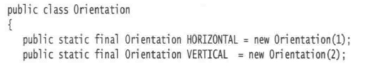
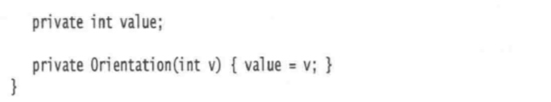
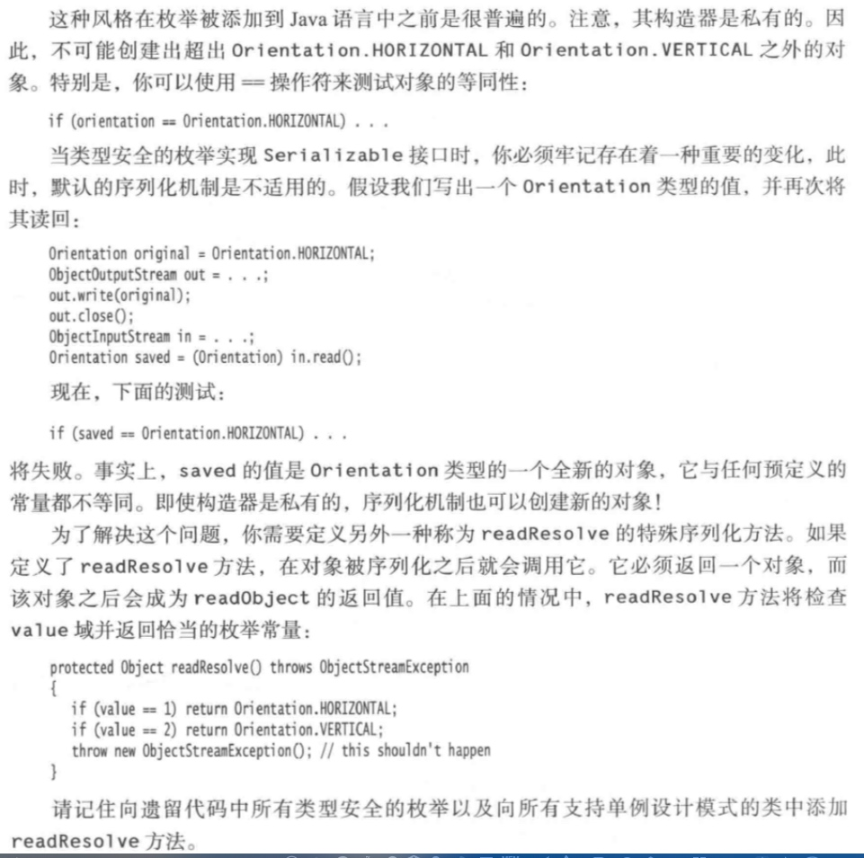
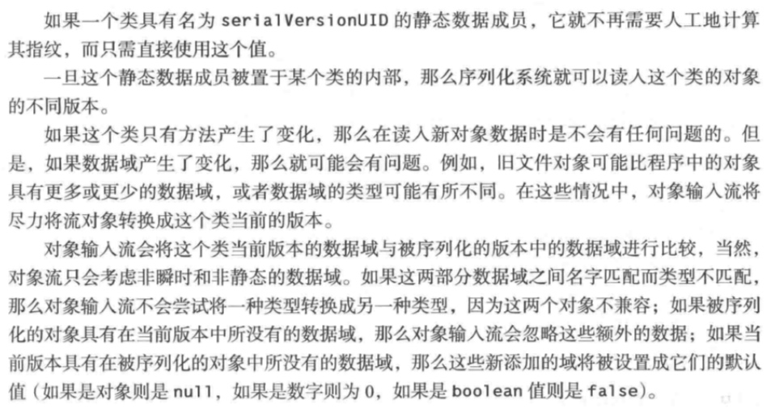

# Java核心技术

# 第一章 Java8流库

先举个例子:

```
    long count = words.stream().filter(w -> w.length() > 12).count();
```

结合这个例子解释流的一些特性:
1. 流不会存储元素,元素可能存储在底层的集合中,或者是按需生成的
2. 流的操作不会修改数据源,例如上面的filter操作不会移除words中的元素,而是新建一个流,其中不包括被过滤掉的元素
3. 流的操作是尽可能惰性执行的.也就是直到需要结果的时候才会执行操作.比如我们只要5个单词,那么流就会在获得5个单词之后就停止过滤.

API:

```
    Stream<T> filter(Predicate<? super T> p);
```
## 流的创建:
Collection接口的方法:

```
    default Stream<E> stream() {
        return StreamSupport.stream(spliterator(), false);
    }
    
    default Stream<E> parallelStream() {
        return StreamSupport.stream(spliterator(), true);
    }
```
Stream中的静态方法:

```
    public static<T> Stream<T> of(T... values) {
        return Arrays.stream(values);
    }
    
    public static<T> Stream<T> of(T t) {
        return StreamSupport.stream(new Streams.StreamBuilderImpl<>(t), false);
    }
    
    public static<T> Stream<T> empty();

```
Array中的静态方法:可以从数组中位于from(包括)到to(不包括)的元素创建一个流

```
    Array.stream(array, from, to);
```
生成无限流:

```
    Stream.generate();
    Stream<Double> randoms = Stream.generate(Math::random);
    
    Stream<BigInteger> integers = Stream.iterate(BigInteger.ZERO, n -> n.add(BigInteger.ONE));
    
```


## filter,map,flatMap
filter函数的参数是一个Predicate<T>接口,它表示从T到boolean的一个函数
当想要对流中的值进行某种转换时,可以使用map方法,并传递一个执行该转换的函数,例如:

```
    Stream<String> lowerCaseWords = words.stream().map(String::toLowerCase);
```
也可以使用lambda表达式:

```
    Stream<String> lowerCaseWords = words.stream().map(s -> s.toLowerCase());
```
flatMap方法:将一个包含流的流摊平为一个流

## 裁剪流和连接流
stream.limit(n)会返回一个截断的流,在n个元素之后结束,如果原来流的长度不足n,则返回原来的流
而stream.skip(n)则是丢弃前n个元素
静态方法Stream.concat(stream1,stream2)则会将两个流连接起来

## distinct
stream.distinct()方法会将流中原来的元素按照同样的顺序剔除重复元素

## sorted

```
    Stream<String> longestFirst = words.stream().sorted(Comparator.comparing(String::length).reversed());
```
要求其中的元素实现Comparable接口

## peek
对于调试流处理语句非常方便,每次获取一个元素时,都会调用peek中的函数

## 约简
常见约简操作:

```
    Optional<T> max(Comparator<? super T> comparator);
    Optional<T> min(Comparator<? super T> comparator);
    Optional<T> findFirst()
    Optional<T> finaAny()  //产生任意一个元素
    boolean anyMatch(Predicate<? super T> predicate)
    boolean allMatch(Predicate<? super T> predicate)
    boolean noneMatch(Predicate<? super T> predicate)
```

## Optional
常见用法:
1. 在没有值时给出默认值,或者按照给定函数计算默认值,或者抛出异常

```
    String result = optionalStr.orElse("");
    String result = optionalStr.orElseGet(() -> Locale.getDefault().getDisplayName());
    String result = optionalStr.orElseThrow(IllegalStateException::new);
```
2. 只有在值存在的情况下才消费该值


```
    opetionalValue.ifPresent(v -> process(v));
```

使用get方法获取值,当optional存在值时会获得其中的元素,如果没有值,则抛出NoSuchElementException异常

创建Optional对象:
Optional.of(result)或者Optional.empty()
注意:of方法的参数如果为null会抛出异常,当不确定是不是null时应使用Optional.ofNullable(result)

## 收集结果

```
    Iterator<T> iterator() //产生一个获取流中元素的迭代器
    void forEach(Consumer<? super T> action)
    Object[] toArray()
    <R,A> R collect(Collector<? super T,A,R> collector)
    getCount(),getMax(),getMin(),getAverage()
```

```
    List<String> result = stream.collect(Collectors.toList());
    TreeSet<String> result = stream.collect(Collectors.toCollection(TreeSet::new))
```

## 收集Map

```
    Map<Integer,Person> idToPerson = people.collect(Collectors.toMap(Person::getId,Function.identity()));
```
如果多个元素具有相同的键,那么就会存在冲突,收集器将会抛出IllegalStateException异常.可以通过提供第三个函数参数来定义冲突后的行为,以确定键的值

```
    Map<String,String> languageNames = locales.collect(Collectors.toMap(Locale::getDisplayLanguage,l -> l.getDisplayLanguage(l), (existingValue,newValue) -> existingValue));
```

## 群组和分区
groupingBy

```
    Map<String,List<Locale>> countryToLocales = locales.collect(Collectors.groupingBy(Locale::getCountry));
API:
    static<T,K> Collector<T,?,Map<K,List<t>>> groupingBy(Function<? super T, ? extends K> classifier)
    static<T> Collector<T,?,Map<boolean,List<T>>> partitionBy(Predicate<? super T> predicate)
```

## 下游收集器

```
    toSet():
    Map<String,List<Locale>> countryToLocales = locales.collect(Collectors.groupingBy(Locale::getCountry, toSet()));
    counting():
    Map<String,List<Locale>> countryToLocales = locales.collect(Collectors.groupingBy(Locale::getCountry, counting()));
    summingInt/Long/Double(),maxBy(),minBy():
    Map<String,Integer> map = cities.collect(groupingBy(City::getState, summingInt(City::getPopulation)));
    Map<String,Integer> map = cities.collect(groupingBy(City::getState, maxBy(Comparator.comparing(City::getPopulation))));

```

## reduce操作:

列表求和:

```
    List<Integer> values = ...
    Optional<Integer> sum = values.stream().reduce((x,y) -> x+y);
 或
    Optional<Integer> sum = values.stream().reduce(Integer::sum);
```

## 基本类型流
IntStream,LongStream等
之前都是用Stream<Integer>,使用基本类型流可以避免装箱
IntStream.of或者Arrays.stream

## 并行流
```
    words.parallelStream();
    Stream.of(wordArray),parallel();
```

# 第二章 输入输出

## 输入输出流
基础:抽象类InputStream和OutputStream
因为面向字节的流不便于处理Unicode形式的信息,从抽象类Reader和Writer继承出专门用于处理Unicode字符的单独的类层次结构.这些类的读入和写出操作都是基于Char(Unicode码元)的.

API:

```
InputStream:

abstract int read():读入一个字节并返回,结尾返回-1
int read(byte[] b)
int read(byte[] b, int off, int len)
long skip(long n):返回实际跳过的字节数
int available():返回在不阻塞的情况下可以获取的字节数
void close()
void mark():在输入流的当前位置打一个标记.如果从输入流中已经读入的字节多于readLimit个,则这个流允许忽略这个标记
void reset():返回到最后一个标记,随后对read的调用将重新读入这些字节.如果当前没有任何标记,则这个流不被重置
boolean markSupported()


OutputStream:

abstract void write(int n)
void write(byte[] b)
void write(byte[] b, int off, int len)
void close()
void flush()
```

即使某个输入/输出流类提供了原生的read和write功能的某些具体方法,应用系统的程序员还是很少使用它们,因为大家感兴趣的是数字,字符串和对象,
而不是原生字节.因此,可以使用InputStream和OutputStream的一些实现类
例如:DataInputStream可以以二进制格式读写所有的Java基本类型,ZipInputStream可以以常见的zip压缩格式读写文件
对于unicode文本,可以使用Reader和Writer的子类

几个附加接口:Closeable,Flushable,Readable,Appendable
注意:Closeable继承了AutoCloseable接口,因此对任何Closeable操作时,都可以使用try-with-resource

### 流的组合
职责分离:
某些输入流可以从文件或其他外部位置上获取字节,而其他的输入流可以将字节变为更为有用的类型.
FilterInputStream,FilterOutputStream
可以通过嵌套过滤器流来添加多重功能,常见的如DataInputStream和BufferedInputStream

## 文本输入与输出
OutputStreamWriter:用指定的编码方式,把unicode码元的输出流转换为字节流.
InputStreamReader:将包含字节的输入流转换为可以产生unicode码元的读入器,默认使用主机系统所使用的默认字符编码方式

```
Reader in = new InputStreamReader(new FileInputStream("data.txt"),StandardCharsets.UTF-8);
```

文本输出:PrintWriter,可以设置自动flush模式
文本输入:Scanner

在进行文本操作时,总是应该手动指定编码,并确认是正确的编码
使用StandardCharsets.Charset对象来代替字符串表示编码

## 序列化
ObjectInputStream,ObjectOutputStream
readObject(),writeObject()
要序列化的类需事先Serializable接口

序列化是怎么应对重复引用的?
每个对象都是用一个序列号保存的
算法:

写:

1. 对你遇到的每一个对象引用都关联一个序列号
2. 对于每个对象,当第一次遇到时,保存其对象数据到输出流中
3. 如果某个对象之前已经被保存过,那么只写出"与之前保存过的序列号为x的对象相同"

读:

1. 对于对象输入流中的对象,在第一次遇到其序列号时,构建它,并使用流中数来初始化它,然后记录这个顺序号和新对象之间的关联.
2. 当遇到"与之前保存过的序列号为x的对象相同"标记时,获取与这个顺序号相关联的对象引用

### 修改默认序列化机制
transient关键字跳过域
对于可序列化的类,定义readObject方法和writeObject方法,会覆盖默认的自动序列化,而是调用这两个方法

#### 注意:单例和类型安全的枚举
在序列化和反序列化时,如果目标对象是唯一的,那么必须加倍当心
如果是使用enum,不用担心
但如果遇到下面这种情况,就要注意:




### 版本管理
使用序列化时需要考虑程序演化的问题,新版本是否能够兼容旧版本?旧版本能否使用新版本的文件?

由于无论类的定义产生了什么样的变化,它的SHA指纹也会跟着变化,而我们知道对象输入流将拒绝读入具有不同指纹的对象.但是,类可以表明它对其早期版本保持兼容.想要做到这一点,需要定义serialVersionUID字段.



### 深拷贝
重写clone()方法,在里面加上序列化反序列化的逻辑

